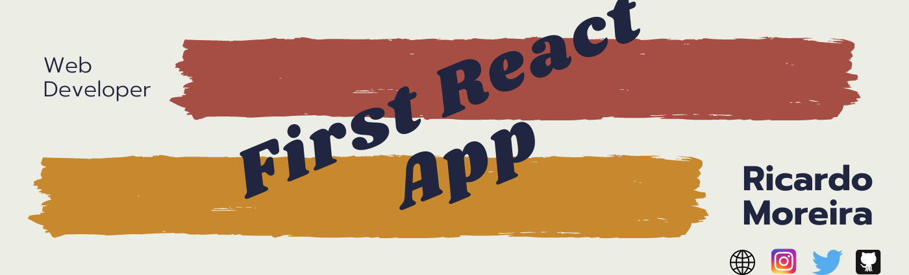

<h1 align="center"> 🔥Into React🔥</h1>

<h2 align="center">My first react approach</h2>

### Index

* [Name](#Name) 👈
* [Links](#Links) 🔗
* [Description](#Description) 📖
* [Languages and Frameworks](####Languages-and-Frameworks) ⚙️
* [Screenshots](#Screenshots) 📱
* [Instalation](#Instalation) 🧩
* [Support](#Support) 🆘
* [Roadmap](#Roadmap) 🗺️
* [Authors and acknowledgment](####Authors-and-acknowledgment) ✍️
* [Project Status](#Project-Status) 📜

# Name

Ruckwater

# Links

[Website](https://cranky-lichterman-91ec08.netlify.app/)

[Presentation](https://www.ricardomoreira.io/projects/2020-06-02-nuxt-website/)
___

# Description

When I decided to choose a framework, Vue was my natural choice but I wanted to take a small dip on reach and this was a nice tutorial I saw explaining the basic principles. I  Learn about

* Map
* State
* Life Cycle
* Rendering

___

# Languages, Frameworks and others

* **React.js** - Framework

____

# Screenshots

____

# Instalation

___

# Support

Have any question or find something that doesn't look good? Let's talk 😊

[Here](https://github.com/mugas)

[And Here](https://www.ricardomoreira.io/about)

____

# Roadmap

____

# Authors-and-acknowledgment

* [This tutorial](https://www.youtube.com/watch?v=DLX62G4lc44&t=11490s)

____

# Project-Status  

Done.

____
